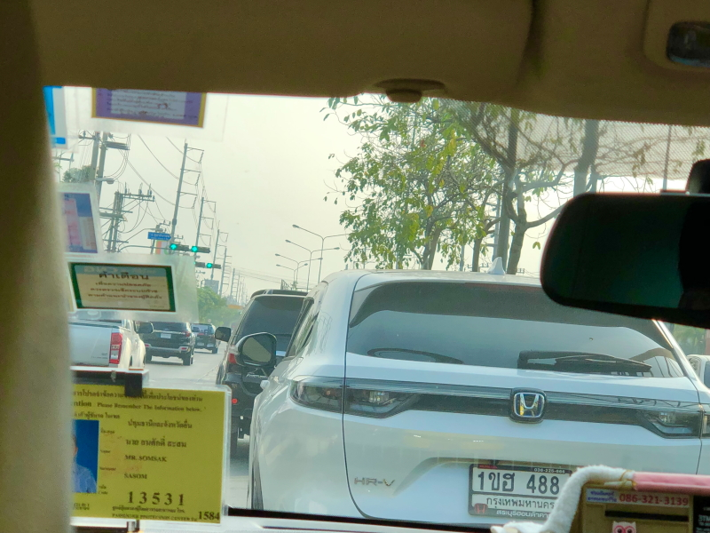
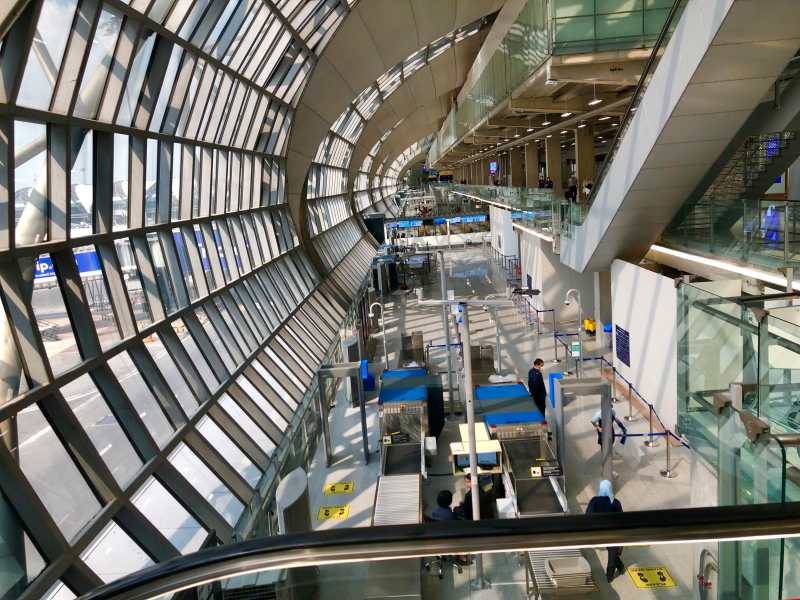
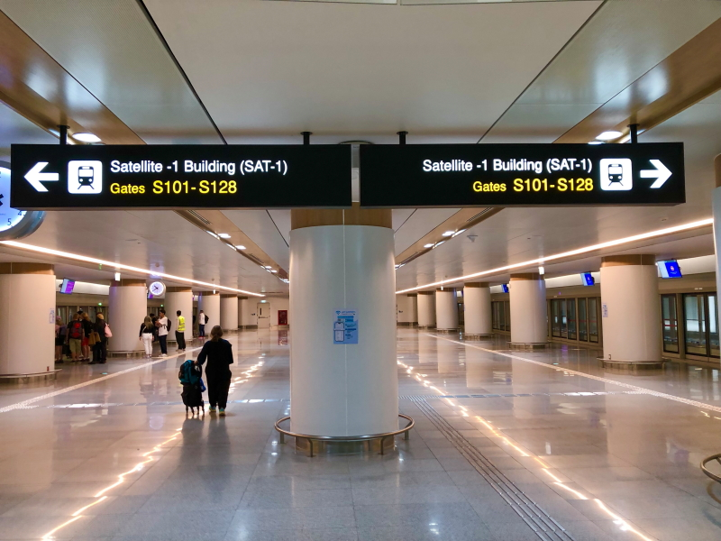
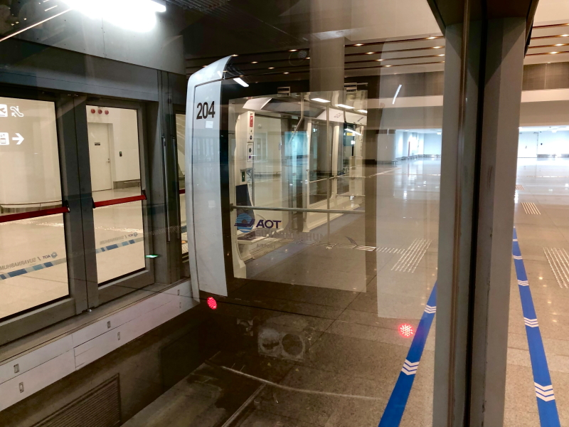

# 2024Jan_Thailand_12

<html>
<head>

<meta charset="UTF-8">
<meta http-equiv="Content-Type" content="text/html; charset=UTF-8">
<meta http-equiv="X-UA-Compatible" content="IE=EmulateIE10" />
<meta http-equiv="X-UA-Compatible" content="IE=edge">

<!--ここから上はお決まりの定型文です-->

<!--ここからが表現の書式などを決めるcssという部分-->

<link href="https://cdnjs.cloudflare.com/ajax/libs/lightbox2/2.7.1/css/lightbox.css" rel="stylesheet">

</head>

<body>

モバイル端末をお使いの場合は、画面を横向きにすると
より見やすくご覧頂けます。

<!--ここ上は、ほぼそのまま使います！-->

<!--QRコードの挿入例-->

 アクセス用QRコード

<marquee direction="left" scrollamount="20" width="30%">(^_^)/~hada</marquee>

<!--流れ文字の挿入例-->
<h1><marquee behavior="left">!!! 2024/01/13 、タイ最終日、バンコクから日本に帰国 !!!</marquee></h1>

<a href="https://torokoid.github.io/2024Jan_Thailand/">Thailand</a>><a href="https://torokoid.github.io/2024Jan_Thailand_2/">Thailand_2</a>><a href="https://torokoid.github.io/2024Jan_Thailand_3/">Thailand_3</a>><a href="https://torokoid.github.io/2024Jan_Thailand__4/">Thailand__4</a>><a href="https://torokoid.github.io/2024Jan_Thailand__5/">Thailand__5</a>><a href="https://torokoid.github.io/2024Jan_Thailand__6/">Thailand__6</a>><a href="https://torokoid.github.io/2024Jan_Thailand__7/">Thailand__7</a>><a href="https://torokoid.github.io/2024Jan_Thailand__8/">Thailand__8</a>><a href="https://torokoid.github.io/2024Jan_Thailand__9/">Thailand__9</a>><a href="https://torokoid.github.io/2024Jan_Thailand_10/">Thailand_10</a>><a href="https://torokoid.github.io/2024Jan_Thailand_11/">Thailand_11</a>>Thailand_12

                          

<!--ここから下が、本体部分-->
 
タイ観光

<h2>13日はタイ最終日、バンコクの街も見納め！</h2>
<h2>早起きして市内の朝焼けなど見てみました</h2>

<h2>バンコク市内の雑踏もしばらく見納め</h2>

<h2>Honda車は結構目にします</h2>

<h2>スワンナプーム空港に到着</h2>

<h2>ロビーで目立つ、赤鬼、青鬼</h2>

<h2>赤鬼、青鬼のペアは、一組ではありません</h2>

<h2>大蛇で綱引き、人間VS鬼軍団</h2>

<h2>出発ゲート、S100番台は空港内電車で移動します</h2>

<h2>運転手も車掌も居ませんね</h2>

<h2>こんな車両でした</h2>

<h2>お店は真新しくて綺麗</h2>

<h2>象さんのオブジェもありました</h2>

<h2>空港トイレのエアータオルは日本のMITSUBISHIでした</h2>

<h2>20:00成田着、帰りの飛行機はこれでした</h2>

 
<h2>タイで気になった動画集</h2>
 
<h2>初めてみるとギョッとしますが、バイクの逆走は合法らしい</h2>
<iframe width="560" height="315" src="https://www.youtube.com/embed/bsZ-Mujp-zc?si=hC5A-_Yx4DN6qV6c" title="YouTube video player" frameborder="0" allow="accelerometer; autoplay; clipboard-write; encrypted-media; gyroscope; picture-in-picture; web-share" allowfullscreen></iframe>
 
<h2>トラックの荷台乗車も頻発中</h2>
<iframe width="560" height="315" src="https://www.youtube.com/embed/QaUvun0VsG8?si=kXjylcS9d7_9BlBF" title="YouTube video player" frameborder="0" allow="accelerometer; autoplay; clipboard-write; encrypted-media; gyroscope; picture-in-picture; web-share" allowfullscreen></iframe>
 
<h2>メコン川を行き来する物流船、浸水ギリギリまで荷物積みます</h2>
<iframe width="560" height="315" src="https://www.youtube.com/embed/r3foq-_UGQI?si=0ccjIpgwLyOg4ma_" title="YouTube video player" frameborder="0" allow="accelerometer; autoplay; clipboard-write; encrypted-media; gyroscope; picture-in-picture; web-share" allowfullscreen></iframe>

 
<h2>タイに２週間いると完全に気候順化しますね 日本の寒さがこたえます</h2>

<!--
  
以下写真集！

1月2日はバンコクからパタヤまでお出かけしました。

-->

  

      

<!--本体はここまで-->

<!--画面に空白地帯を作って、背景が見えるようにしています-->
                                              

<!-- フッタ -->
<footer>

Copyright 2024/01/13 S.Hada

</footer>

<!--HPにさまざまなJavaScriptを呼び込むための書式-->

